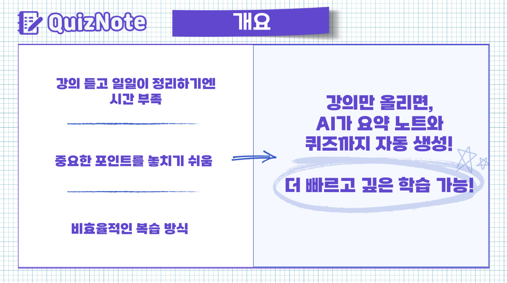
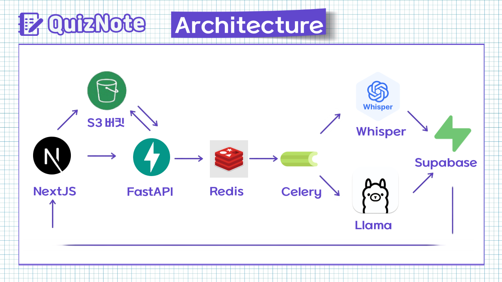
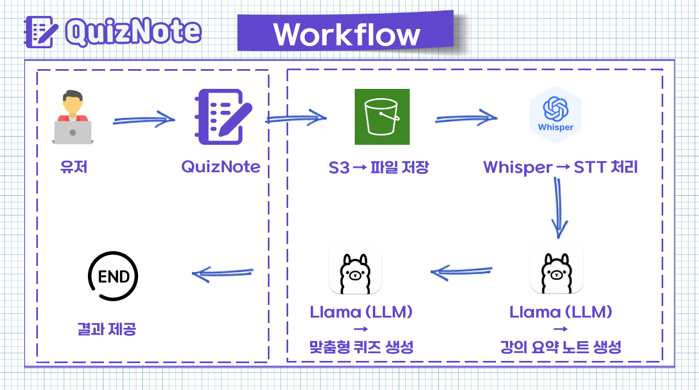

# 📘 QuizNote




---
## 🌐 사이트
https://quiz-note-frontend.vercel.app/

## 📌 프로젝트 소개

**QuizNote**는 AI 기반의 스마트 학습 플랫폼입니다.  
강의 **녹음 파일** 또는 **유튜브 강의 URL**을 업로드하면, AI가 **음성을 텍스트로 변환**하고  
그 내용을 분석하여 **자동으로 강의 요약 노트와 퀴즈**를 생성해줍니다.

---

## 🖼️ 핵심 이미지

| 아키텍처 | 워크플로우 |
|:--------:|:----------:|
|  |  |

---

## 👥 팀원 소개

<div align="center">

|  |  |  |
|:--:|:--:|:--:|
| **김건우** | **백상윤** | **이하은** |
| [GitHub](https://github.com/kimkuns91) | [GitHub](https://github.com/saharapaik) | [GitHub](https://github.com/HACore) |

</div>

---

## 🚀 프로젝트 구조
```
📦 QuizNote
 ┣ 📂 prisma           # FastAPI 기반 백엔드
 ┣ 📂 docs             # 문서
 ┣ 📂 src              # Next.js 기반 프론트엔드
   ┣ 📂 actions        # 서버 액션
   ┣ 📂 app            # Next.js 앱 라우터
   ┣ 📂 components     # 리액트 컴포넌트
   ┣ 📂 config         # 환경 설정
   ┣ 📂 constants      # 상수 정의
   ┣ 📂 hooks          # 커스텀 훅
   ┣ 📂 i18n           # 국제화 설정
   ┣ 📂 lib            # 유틸리티 함수
   ┣ 📂 messages       # 다국어 메시지
   ┣ 📂 services       # API 서비스
   ┣ 📂 store          # 상태 관리
   ┣ 📂 styles         # 전역 스타일
   ┗ 📜 middleware.ts  # Next.js 미들웨어
```

---

## ⚙️ 기술 스택

### 🔷 Frontend
- **Next.js 15** – 서버 사이드 렌더링 프레임워크
- **React 19** – 최신 UI 컴포넌트 라이브러리
- **TypeScript** – 정적 타입을 지원하는 자바스크립트 슈퍼셋
- **Tailwind CSS 4** – 유틸리티 기반 CSS 프레임워크
- **TanStack Query (React Query)** – 서버 상태 관리
- **NextAuth.js 5** – 인증 시스템
- **Prisma 6** – 타입 안전한 ORM
- **next-intl** – 국제화(i18n) 지원

### 🟦 Backend
- **FastAPI** – 고성능 Python API 서버
- **SQLAlchemy** – 데이터베이스 ORM
- **Whisper AI** – OpenAI의 음성 인식 모델
- **OpenAI API** – 요약 및 퀴즈 생성
- **MLP-KTLim/llama-3-Korean-Bllossom-8B** – 한국어 특화 모델
- **AWS S3** – 미디어 파일 저장소
- **PyTorch** – 딥러닝 프레임워크
- **Redis + Celery** – 비동기 작업 처리

### 💻 Infra
- **KakaoCloud** – 클라우드 인프라
- **인스턴스 타입**: gn1i.2xlarge (GPU 인스턴스)
- **운영체제**: Ubuntu 20.04 - Nvidia

---

## 🚀 시작하기

### 📥 설치 및 실행

```bash
# 1. 저장소 클론
git clone [repository-url]
# 2. 환경 변수 설정
cp .env.example .env
# .env 파일 내 API 키 및 자격 설정

```

### ⚙️ 개발 환경 개별 실행

#### ▶ 프론트엔드 실행
```bash
yarn install
npx prisma generate && yarn dev
```

## 🧠 주요 기능
- **강의 업로드**
  - 로컬 녹음 파일 업로드
  - 다양한 형식의 미디어 파일 지원

- **AI 기반 학습 지원**
  - 음성-텍스트 변환 (STT)
  - 다국어 자동 감지 및 변환
  - 강의 내용 자동 요약
  - 핵심 개념 추출
  - 맞춤형 퀴즈 생성

- **학습 관리**
  - 학습 이력 관리
  - 퀴즈 결과 분석
  - 학습 진도 추적

- **커뮤니티**
  - 학습 노트 공유
  - 퀴즈 공유 및 풀기

## 📄 라이센스
이 프로젝트는 MIT 라이센스를 따릅니다. 자세한 내용은 [LICENSE](LICENSE) 파일을 참조하세요.
